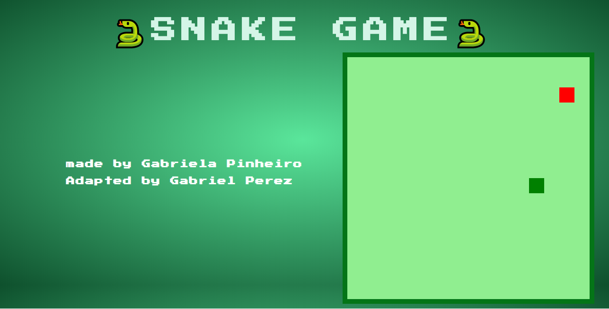

<h1 align="center">
  🐍 Snake Game 
</h1>

<p align="center">
  

  

  

  <br>

  <a href="https://www.codacy.com/manual/Gabriel4420/Snake-Game?utm_source=github.com&amp;utm_medium=referral&amp;utm_content=Gabriel4420/Snake-Game&amp;utm_campaign=Badge_Grade">
    
  </a>

  

  <a href="https://www.linkedin.com/in/gabriel-rodrigues-perez-2069b072/">
    
  </a>
</p>

---

<p align="center">
  
</p>

---

# Indice

- :rocket: [Sobre o Projeto](#rocket-sobre-o-projeto)
- 👨‍💻️ [Tecnogias utilizadas](#%EF%B8%8F-tecnogias-utilizadas)
- 📦️ [Como utilizar o projeto](#%EF%B8%8F-como-utilizar-o-projeto)

---

## :rocket: Sobre o Projeto

O projeto é uma recriação do snake game dos anos 80, feito em javascript vanilla e utilizando canvas do html e css.

---

## 👨‍💻️ Tecnogias utilizadas

O projeto foi desenvolvido utilizando as seguintes tecnologias:

- HTML5
- CSS3
- Javascript


### IDE

  - [Visual Studio Code](https://code.visualstudio.com/)

---

## 📦️ Como utilizar o projeto

Para copiar o projeto, utilize os comandos:

```bash
  # Clonar o repositório
  ❯ git clone https://github.com/Gabriel4420/Snake-Game

  # Entrar no diretório
  ❯ abra no browser o arquivo html
```
---

<h4 align="center">
  Feito com ❤️ por Gabriel 👋️ <a href="mailto:gabriel_rodrigues_perez@hotmail.com">Entre em contato!</a>
</h4>

<p align="center">
  <a href="https://www.linkedin.com/in/gabriel-rodrigues-perez-2069b072/">
    
  </a>
  <a href="https://www.facebook.com/gabriel.rodrigues.perez/">
    
  </a>
  <a href="https://www.instagram.com/gabriel_rodrigues_perez/?hl=pt-br">
    
  </a>
 
</p>
